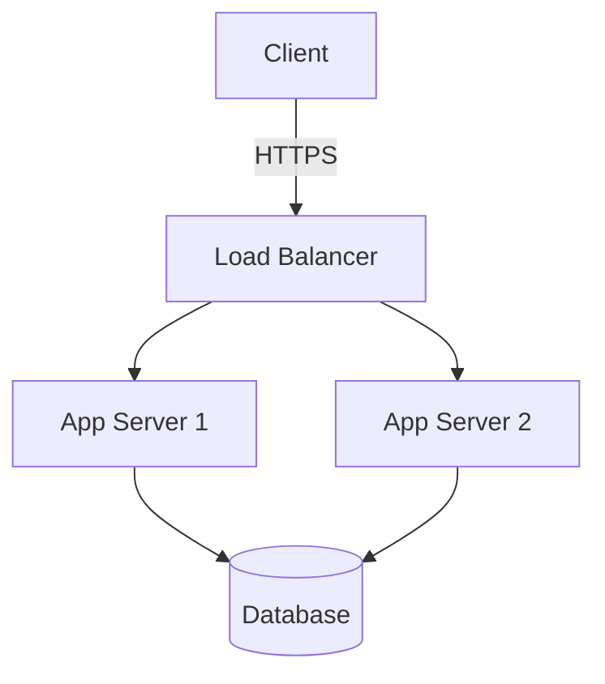
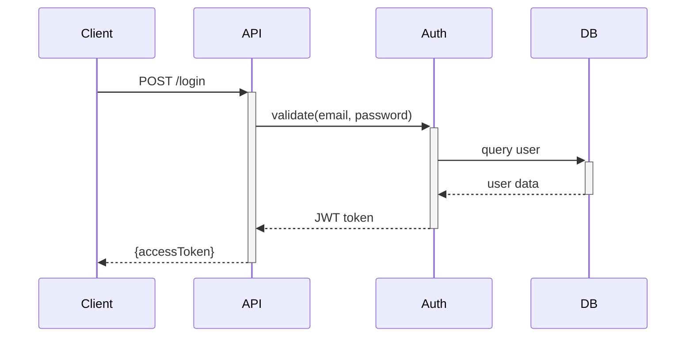
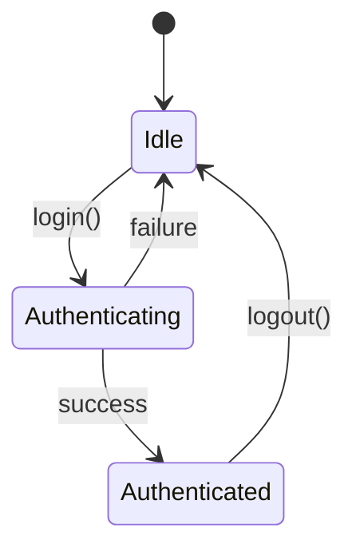

# Write-Spec

This skill covers:
- [Frontmatter](#frontmatter) - Required metadata fields
- [Body Structure](#body-structure) - Template and organization
- [Scope Definition](#scope-definition) - File path patterns
- [Style Guide](#style-guide) - What to include/exclude
- [Diagramming](#diagramming) - Mermaid examples
- [Deprecation](#deprecation) - Archiving obsolete specs
- [Multi-File Specs](#multi-file-specs) - Complex subsystems
- [Examples](#examples) - Good vs bad specs

---

## Frontmatter

Required YAML header for all specs:

```yaml
---
name: Authentication System
description: JWT-based auth with refresh tokens and rate limiting
updated: 2026-01-27
scope:
  - /src/auth/**
  - /src/middleware/auth.ts
  - /config/security.ts
deprecated: false
replacement: ""    # see [Deprecation](#deprecation
---
```

| Field | Required | Description |
|-------|----------|-------------|
| `name` | Yes | Spec title |
| `description` | Yes | One-sentence summary |
| `updated` | Yes | Last modification (YYYY-MM-DD) |
| `scope` | Yes | File paths this spec covers (glob patterns) |
| `deprecated` | No | `true` if spec is obsolete |
| `replacement` | No | Path to new spec (if deprecated) |

---

## Body Structure

NOTE: This is an example, The specific structure of standards to be adopted is determined by project requirements.
```markdown
# <Spec Name>

## Overview

**Purpose**: Why this spec exists (1-2 sentences)
**Scope**: What this covers and what it doesn't

## Current Design

### Architecture
<!-- Mermaid or PlantUML diagram -->

### Components
| Component | Responsibility | Location |
|-----------|----------------|----------|
| AuthService | Token generation | `/src/auth/service.ts` |

### Key Decisions
**JWT over Sessions**: Stateless, scalable | Trade-off: Cannot revoke

## Development Guidelines

### File Organization
### API Contracts
### Configuration
### Testing Requirements

## References
- Related: [Other Spec](./other.md)
```

---

## Scope Definition

Agents use `scope` to find relevant files. Use glob patterns:

```yaml
scope:
  - /src/auth/**           # All files in directory
  - /src/middleware/auth.ts # Specific file
  - /config/security.ts     # Config
  - /tests/auth/**          # Tests
```

**Include**: Primary implementation, tests, config
**Omit**: Generic utilities unless domain-specific

Good scope → Agent knows where to start
Bad scope → Agent searches entire codebase

---

## Style Guide

### ✅ MUST Include

1. **File paths**: Every component needs a location
2. **Concrete values**: "15min expiry" not "short expiry"
3. **Decision rationale**: Why this design, what trade-offs
4. **Diagrams**: Architecture and flows (Mermaid/PlantUML)

### ❌ MUST NOT Include

1. **Change logs**: History lives in git, not specs
   ```markdown
   <!-- DON'T -->
   ## History
   ### v1 (2025-01) - Used sessions
   ### v2 (2025-06) - Switched to JWT
   ```

2. **Multiple unrelated topics**: One doc = one topic
   ```markdown
   <!-- DON'T: Too broad -->
   # Backend Architecture
   ## Database Design
   ## API Specification
   ## Deployment Pipeline
   ```

3. **Marketing language**: No "revolutionary", "cutting-edge", "best practices"
   ```markdown
   <!-- DON'T -->
   Our authentication leverages industry best practices...

   <!-- DO -->
   JWT tokens (RS256, 15min expiry) with refresh tokens (7d).
   ```

4. **Vague statements**: Quantify everything
   ```markdown
   <!-- DON'T --> "Fast response times"
   <!-- DO -->    "P95 latency <100ms"

   <!-- DON'T --> "High availability"
   <!-- DO -->    "99.9% uptime (8.7h downtime/year)"
   ```

5. **Common knowledge**: Don't explain REST, HTTP, basic concepts

6. **Future features**: Document current state only (YAGNI)

### Language

- **Imperative mood**: "Validate tokens" not "The system should validate"
- **Direct**: Avoid "It's worth noting...", "As mentioned earlier..."
- **Precise**: "Use Redis (5min TTL)" not "Consider using Redis"

---

## Diagramming

Use Mermaid or PlantUML. Both render in GitHub, VS Code, IDEs.

**Architecture**:


**Sequence**:


**State machine**:


Avoid ASCII art—wastes space, breaks with fonts, doesn't render.

---

## Deprecation

When design becomes obsolete:

### 1. Mark in Frontmatter

```yaml
deprecated: true
replacement: /spec/auth-v2.md
```

### 2. Move to Archive

```
spec/
├── auth.md              # Current
└── archive/
    └── auth-v1.md       # Deprecated
```

### 3. Add Notice

```markdown
> ⚠️ **DEPRECATED**: Replaced by [Auth v2](../auth.md)
> Last used: 2025-12-31
```

### 4. Strip Details

Keep only: what it was, why deprecated, link to replacement.

---

## Multi-File Specs

For complex subsystems, use directory structure:

```
spec/payment-system/
├── index.md          # Entry point
├── gateway.md        # Stripe integration
├── webhooks.md       # Event handling
└── reconciliation.md # Ledger matching
```

### index.md

```yaml
---
name: Payment System
description: Complete payment processing subsystem
updated: 2026-01-27
files:
  - gateway.md
  - webhooks.md
  - reconciliation.md
scope:
  - /src/payment/**
  - /src/webhooks/payment.ts
---

# Payment System

## Overview
End-to-end payment processing with Stripe.

## Components
- [Gateway](./gateway.md) - Stripe API
- [Webhooks](./webhooks.md) - Events
- [Reconciliation](./reconciliation.md) - Ledger

## Shared Concepts
### Payment States
...
```

---

## Examples

### ✅ Good Spec

```markdown
---
name: Rate Limiting
description: Token bucket algorithm with Redis backend
updated: 2026-01-27
scope:
  - /src/middleware/rate-limit.ts
  - /src/cache/redis.ts
---

# Rate Limiting

## Overview
**Purpose**: Prevent API abuse
**Algorithm**: Token bucket (allows burst)

## Configuration

| Endpoint | Limit | Window | Burst |
|----------|-------|--------|-------|
| POST /auth/login | 5 | 15min | 10 |
| GET /api/* | 100 | 1min | 150 |

## Implementation

```typescript
// /src/middleware/rate-limit.ts
interface RateLimitConfig {
  limit: number;    // Tokens per window
  window: number;   // Seconds
  burst: number;    // Max bucket size
}
```

**Storage**: Redis sorted set (`rl:{ip}:{endpoint}`)

## Error Response

HTTP 429, `Retry-After` header:
```json
{ "error": "Rate limit exceeded", "retryAfter": 847 }
```
```

### ❌ Bad Spec

```markdown
# Our Amazing API

## Introduction
Welcome to our revolutionary API! We've built this using cutting-edge
best practices to ensure maximum scalability and performance.

## Architecture
Our system is designed to be highly modular and extensible, allowing
for future enhancements and integrations.

## Endpoints
We have various endpoints for different operations. The authentication
system is secure and follows industry standards.

## Future Plans
We're planning to add ML and blockchain in future versions.
```

**Problems**: Marketing fluff, no concrete info, no file paths, includes unbuilt features.

---

## Maintenance Checklist

When updating specs:
- [ ] `updated` field current
- [ ] `scope` matches actual files
- [ ] Diagrams reflect current architecture
- [ ] Code examples compile
- [ ] Links to other specs valid

**Review frequency**:
- Critical specs (auth, data): Quarterly
- Stable specs (coding standards): Annually
