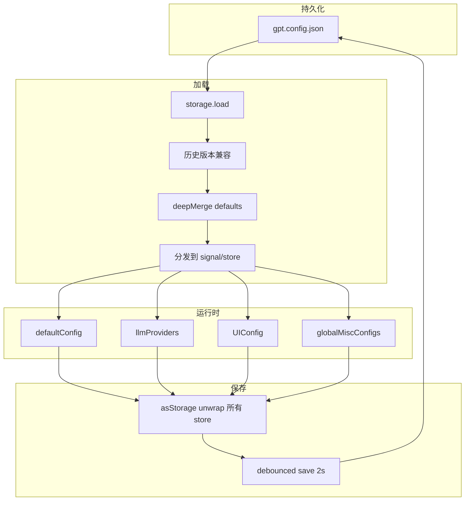
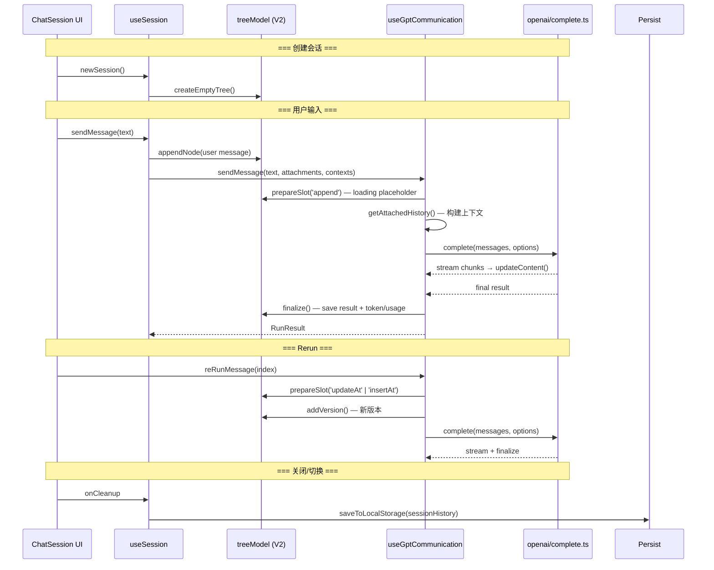

# GPT Module — Architecture Overview

## 1. Module Entry & Initialization

`src/func/gpt/index.ts` 是插件的「GPT 功能」入口。向插件框架导出的结构：

```typescript
// 模块声明（给插件框架）
export let name = "GPT";
export let enabled = false;
export const declareToggleEnabled = { title: '🤖 ChatGPT', defaultEnabled: false };
export const declareSettingPanel = [{ key: 'GPT', title: '🤖 GPT', element: setting.GlobalSetting }];

// 生命周期
export const load = async (plugin: FMiscPlugin) => { ... }
export const unload = async (plugin: FMiscPlugin) => { ... }

// 公开 API
export const openChatTab = async (reuse?, history?) => { ... }
export const openGptWindow = async (history?) => { ... }
export { openai };  // complete() 等
```

### load() 初始化序列

```
load(plugin)
├── registerGlobalChat(plugin)     → 注册新窗口 Tab 类型
├── plugin.registerMenuTopMenu()   → 顶栏菜单（新建对话/历史记录/Tool Hub）
├── plugin.addCommand() ×2         → Ctrl+Shift+L / Shift+Alt+C
├── setting.load(plugin)           → 加载配置持久化数据
│   └── if pinChatDock → addDock()  → 侧边栏固定对话窗口
├── clickEvent.register()          → 文档图标点击事件（打开导出历史）
├── plugin.eventBus.on('open-siyuan-url-plugin')  → URL 协议打开历史
├── addSVG(plugin)                 → 注入图标 symbol
├── chatInDoc.init()               → 文档内嵌入对话功能
├── persist.restoreCache()         → 恢复消息缓存
├── persist.updateCacheFile()      → 更新缓存文件（防丢失）
└── globalThis.fmisc['gpt'] = { complete }  → 暴露给其他模块
```

### 用户触达面

| 入口 | 触发方式 | 代码 |
|------|---------|------|
| 顶栏菜单 → 新建 GPT 对话 | 点击 | `openChatTab(false)` |
| 顶栏菜单 → GPT 对话记录 | 点击 → 历史列表 | `solidDialog(HistoryList)` |
| 快捷键 Ctrl+Shift+L | 键盘 | `openChatTab(true)` — reuse |
| 快捷键 Shift+Alt+C | 键盘 | `openGptWindow()` — 独立窗口 |
| 侧边栏 dock | 自动（如果 `pinChatDock` 开启） | `addDock()` |
| 文档图标点击 | 点击带 GPT 标记的文档 | `useSyDocClickEvent()` |
| URL 协议 | `siyuan://plugins/.../chat-session-history?historyId=xxx` | `openUrl()` |

---

## 2. Configuration System

### 存储架构

```
model/config.ts (响应式 stores)
├── defaultModelId: SignalRef<ModelBareId>          "siyuan" 或 "name@provider"
├── defaultConfig: StoreRef<IChatSessionConfig>     全局对话默认配置
├── llmProviders: StoreRef<ILLMProviderV2[]>         Provider + Model 配置列表
├── UIConfig: StoreRef<{inputFontsize, msgFontsize, maxWidth}>
├── promptTemplates: StoreRef<IPromptTemplate[]>
├── globalMiscConfigs: StoreRef<{...}>               杂项（API keys, 开关...）
└── toolsManager: StoreRef<{...}>                    工具权限配置

model/storage.ts
├── save()  → plugin.saveData("gpt.config.json", asStorage())
└── load()  → plugin.loadData() → 历史版本兼容() → deepMerge → 分发到 stores

model/config_migration.ts
└── 历史版本兼容(data, storeName)  → CURRENT_SCHEMA='3.1'
    按 schema version 递增执行迁移块
```

### 数据流



**Agent trap**：`save()` 是 debounce 2 秒的。在 save 触发前如果页面关闭，数据丢失。`persist.updateCacheFile()` 在 `beforeunload` 事件中做最终写入来兜底。

---

## 3. Settings UI

`setting/index.tsx` — `GlobalSetting` 组件，5 个 Tab：

| Tab | 组件 | 存储目标 |
|-----|------|---------|
| 💬 对话设置 | `ChatSetting` + 杂项开关 | `defaultConfig` + `globalMiscConfigs` |
| 📝 Prompt 模板 | `PromptTemplateSetting` | `promptTemplates` |
| 🔌 Provider 配置 | `ProviderSettingV2` | `llmProviders` |
| 🛠️ 工具 | `ToolsManagerSetting` + API keys | `toolsManager` + `globalMiscConfigs` |
| 🐍 自定义脚本 | `CustomScriptToolSetting` | 外部脚本文件 |

每个 Tab 修改的是全局 store，通过 SolidJS 响应式系统即时生效。`onCleanup` 触发 `save()`。

---

## 4. Provider & Model Lifecycle

### 4.1 模型 ID 体系

```
ModelBareId = "modelName@providerName" | "modelName@providerName:type" | "siyuan"
```

### 4.2 从存储到运行时

```mermaid
graph TD
    Storage[llmProviders[] in config.json]
    Storage --> |load| Store[llmProviders StoreRef]
    Store --> |listAvialableModels| List[bareId 列表 for UI select]
    Store --> |useModel bareId| Resolve[model_resolution.ts]
    Resolve --> |match model + provider| Runtime[IRuntimeLLM]
    
    Resolve --> |组装 URL| URL[baseUrl + endpoints type]
    URL --> Runtime
```

### 4.3 IRuntimeLLM 结构

```typescript
interface IRuntimeLLM {
  model: string;          // 实际 API model name
  url: string;            // baseUrl + endpoint
  apiKey: string;
  bareId: ModelBareId;
  type: LLMServiceType;   // chat | image-gen | audio-stt | audio-tts
  protocol?: 'openai' | 'claude' | 'gemini';
  config?: ILLMConfigV2;   // 关联的模型配置（capabilities, limits, options）
  provider?: Omit<ILLMProviderV2, 'models'>;  // provider 元数据（customHeaders 等）
}
```

### 4.4 模型预设匹配

`model/preset.ts` — `createModelConfig(modelName)` 遍历 `MODEL_PRESETS` 按正则匹配，返回带 capabilities/limits/options 的 `ILLMConfigV2`。见 [Cross-File Architecture §7](gpt-chat-module-cross-file-architecture.md#7-model-preset-matching模型预设匹配)。

---

## 5. Chat Session Lifecycle (V2)

### 5.1 组件树

```
ChatSession (chat/main.tsx)
└── SimpleProvider { model, config, session }
    ├── Topbar (标题/工具/导出/历史)
    ├── MessageItems (消息列表)
    │   ├── MessageItem × n
    │   └── InlineApprovalCard (工具审批)
    ├── InputContainer (输入框 + toolbar)
    │   ├── Model selector
    │   ├── Context menu (@)
    │   └── Textarea
    └── Dialogs (设置/系统提示/自定义选项/历史列表)
```

### 5.2 useSession Hook 内部

```
useSession({ model, config, scrollToBottom })
  ├── treeModel (use-tree-model)        ← V2 树形消息模型
  ├── gpt (use-gpt-communication)       ← API 通信
  │   ├── sendMessage()
  │   ├── reRunMessage()
  │   ├── abortMessage()
  │   └── autoGenerateTitle()
  ├── toolExecutor (ToolExecutor)        ← 工具系统
  ├── deleteHistory (use-delete-history) ← 删除历史管理
  └── session-level state
      ├── systemPrompt signal
      ├── customOptions signal
      ├── multiModalAttachments signal
      ├── contexts store
      └── sessionTags signal
```

### 5.3 会话生命周期



### 5.4 V2 树模型核心概念

参见 [Cross-File Architecture §8](gpt-chat-module-cross-file-architecture.md#8-v2-tree-model-rationalev2-树模型设计意图)。

简要：
- **worldLine**：从 root 到当前活跃叶子节点的路径 — 这就是「当前对话线」
- **version**：同一回答的不同生成（不同模型、rerun） — 存储在 `versions` map
- **branch**：手动分叉出不同的 worldLine
- **separator**：上下文断点。构建上下文时不跨越 separator（除非 pinned）
- **pin**：强制包含标记。无视 separator 和 sliding window

---

## 6. API Communication Flow

### 6.1 完整发送链路

```
UI: handleSubmit(userText)
  → session.sendMessage(userText)
    → useGptCommunication.sendMessage(text, attachments, contexts)
      ├─ [1] 确定 modelType (chat | image-gen | audio-stt | audio-tts)
      ├─ [2] preValidateModalType() — 检查模态是否有必要附件
      ├─ [3] getAttachedHistory() — 构建上下文消息列表
      ├─ [4] lifecycle.prepareSlot('append') — 创建 loading 占位符
      ├─ [5] executeByModalType()
      │   ├─ chat: chatHandler.execute()
      │   │   ├─ buildChatOption()  — 合并 config + customOptions + tools
      │   │   ├─ buildSystemPrompt() — 时间 + user rule + privacy rule + tool rules
      │   │   ├─ maskMessages()     — 隐私屏蔽（如果启用）
      │   │   ├─ gpt.complete(messages, options)
      │   │   │   ├─ adaptChatOptions() — sanitize
      │   │   │   └─ fetch() + stream parsing
      │   │   └─ recoverContent()   — 隐私恢复
      │   ├─ image-gen: imageHandler.generate() → generateImage()
      │   └─ audio-*: audioHandler.* → transcribeAudio() / textToSpeech()
      ├─ [6] handleToolChain() — 如果返回 tool_calls → 多轮工具调用链
      └─ [7] lifecycle.finalize() — 保存结果到 treeModel
```

### 6.2 buildChatOption — 参数合并

参见 [Cross-File Architecture §1](gpt-chat-module-cross-file-architecture.md#1-parameter-merge-chain参数合并链)。

### 6.3 协议分发

参见 [Cross-File Architecture §4](gpt-chat-module-cross-file-architecture.md#4-protocol-dispatch协议分发)。

### 6.4 流式响应处理

```
fetch() response.body
  → pipeThrough(TextDecoderStream)
  → pipeThrough(TransformStream)
    → 每行 parse: "data:{...}" → JSON.parse
    → handleStreamChunk(line)
      → extract: content, reasoning_content, tool_calls, references
      → save to accumulators
      → streamMsg(content) callback → UI 实时更新
  → reader.read() loop until done/aborted
  → adaptToolCalls(allChunks) — 合并分片的 tool_calls
  → 组装 ICompletionResult
```

---

## 7. Cross-Cutting Concerns

### 7.1 隐私屏蔽

```
发送前: maskMessages(messages, privacyFields) → masked messages + maskSchema
接收后: recoverContent(result.content, maskSchema) → unmasked content
```

配置在 `defaultConfig.enablePrivacyMask` + `defaultConfig.privacyFields`。

### 7.2 Context Provider 系统

`context-provider/index.ts` 管理一组可插拔的上下文提供器：

```
getContextProviders() → IContextProvider[]
  ├── SelectedTextProvider   — 用户选区
  ├── ActiveDocProvider      — 当前文档
  ├── BlocksProvider         — 块引用
  ├── URLProvider            — URL 抓取
  ├── DailyNoteProvider      — 日记
  ├── RecentDocProvider      — 最近文档
  ├── SQLSearchProvicer      — SQL 检索
  ├── TextSearchProvider     — 全文搜索
  └── UserInputProvider      — 用户键入
```

用户在输入框输入 `@` 触发选择菜单 → `executeContextProvider(provider)` → 结果注入 `session.contexts`。

### 7.3 工具系统

```
ToolExecutor (tools/executor.ts)
├── register(tool) — 注册工具
├── hasEnabledTools() → getEnabledToolDefinitions() → IToolDefinition[]
├── execute(toolName, args) → ToolResult
└── toolRules() → 注入 system prompt 的工具规则

工具分类:
├── basic.ts          — datetime, calculator
├── file-system/      — 文件编辑/查看/shell
├── siyuan/           — 思源笔记内容操作/搜索
├── web/              — 网页搜索/抓取
├── custom-program-tools/ — 自定义 Python/PowerShell 脚本工具
└── toolcall-script/  — 自定义 JS 工具调用脚本
```

工具审批流程：`executor.ts` → `approval-ui.tsx (InlineApprovalCard)` → 用户 approve/reject → 继续或中止。

### 7.4 持久化

```
persistence/
├── local-storage.ts   — localStorage (快速, 有容量限制)
├── json-files.ts      — 归档为 JSON 文件
├── sy-doc.ts          — 导出到思源文档
├── assets.ts          — 附件管理
├── import-platform.ts — 导入外部平台对话 (Google AI Studio, Aizex, Cherry Studio)
└── index.ts           — 统一 API
```

---

## 8. Key Files Index

| 文件 | 角色 |
|------|------|
| `index.ts` | 模块入口：注册菜单/命令/dock/事件 |
| `model/config.ts` | 全局响应式 stores |
| `model/storage.ts` | 持久化 save/load |
| `model/config_migration.ts` | Schema 版本迁移 |
| `model/model_resolution.ts` | `useModel()` — bareId → IRuntimeLLM |
| `model/preset.ts` | 模型预设匹配 |
| `setting/index.tsx` | 设置 UI 容器（5 Tab） |
| `setting/ChatSetting.tsx` | 对话参数设置表单 |
| `setting/ProviderSettingV2.tsx` | Provider/模型配置 |
| `chat/main.tsx` | ChatSession 主组件 |
| `chat/ChatSession/use-chat-session.ts` | 会话总控 hook |
| `chat/ChatSession/use-tree-model.ts` | V2 树形消息模型 |
| `chat/ChatSession/use-openai-endpoints.ts` | API 通信编排层 |
| `openai/complete.ts` | complete() — 协议分发 + OpenAI fetch |
| `openai/adpater.ts` | 消息/参数适配 |
| `openai/claude-complete.ts` | Claude Messages API |
| `openai/gemini-complete.ts` | Gemini API |
| `types.ts` | 核心类型（IMessage, IChatCompleteOption, Provider） |
| `types-v2.ts` | V2 树模型类型 |

---

## 9. Related Spec-Docs

- [Cross-File Architecture](gpt-chat-module-cross-file-architecture.md) — 跨文件调用链、隐式约定、命名陷阱、Agent 避坑指南
