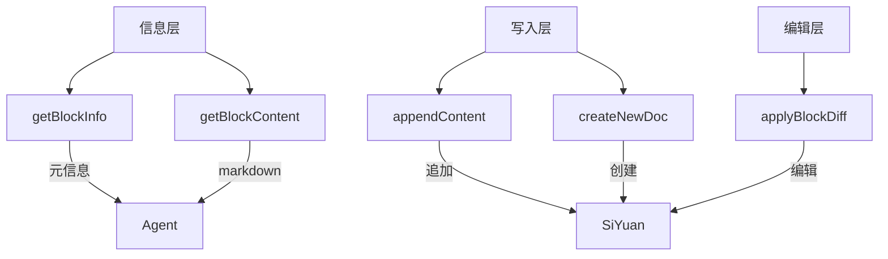
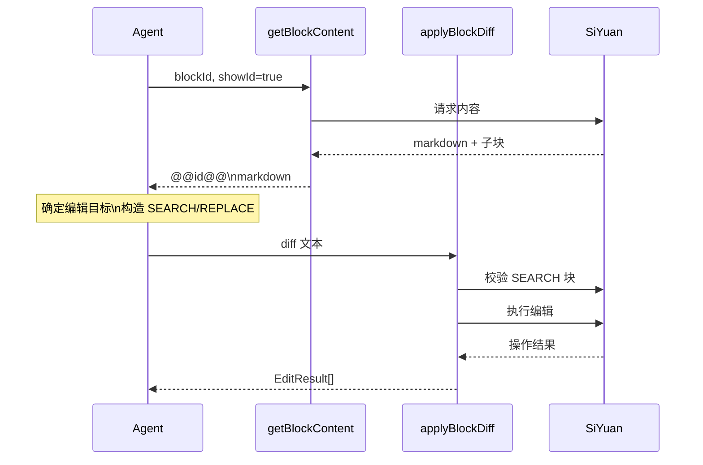
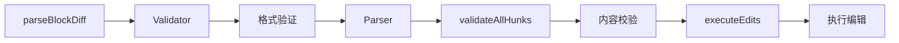

# 思源内容工具系统

## Overview

### 设计目的

提供从块元信息查询到精确内容编辑的完整工具链，支持 Agent 对思源笔记内容的读取、追加和修改操作。

核心需求：
1. **分层查询**：从轻量级元信息到完整 markdown 内容
2. **安全写入**：追加操作不破坏现有内容
3. **精确编辑**：块级定位，内容校验，最小化破坏性

### 当前设计

工具分为三层：



- **信息层**：查询但不修改
- **写入层**：安全的追加操作
- **编辑层**：精确的块级编辑（需要内容校验）

## Architecture

### 工具职责划分

| 工具 | 职责 | 输入 | 输出 | 副作用 |
|------|------|------|------|--------|
| getBlockInfo | 获取块元信息 | 块 ID(s) | BlockInfo 对象 | 无 |
| getBlockContent | 获取块 markdown | 块 ID + 参数 | 格式化文本 | 无 |
| appendContent | 追加内容 | markdown + 目标 | targetId | 写入 |
| createNewDoc | 创建文档 | 标题 + 位置 | docId + path | 创建 |
| applyBlockDiff | 编辑块内容 | diff 文本 | EditResult[] | 修改 |

### 典型工作流



## Components

### 1. getBlockInfo

**实现位置**: `/src/func/gpt/tools/siyuan/content-tools.ts#L40-L296`

**设计目的**：轻量级查询块属性，不加载 markdown 内容（避免大文档的性能开销）

**当前设计**：
- 返回固定结构的 BlockInfo 对象
- 包含：类型、路径、内容长度、子块数、TOC（文档）、面包屑
- 支持批量查询（逗号分隔多个 ID）

**实现方案**：

#### BlockInfo 数据结构

```typescript
interface BlockInfo {
    id: string;
    type: string;               // 'd', 'h', 'p', 'l', 'c', 'b', 's', etc.
    block?: Block;              // 完整 block 对象（用于 YAML-like 格式展示属性）

    contentLength: number;      // content 字段长度
    markdownLength: number;     // markdown 字段长度
    markdownPreview: string;    // 前 10 个字符

    // 容器块专属
    childBlockCount?: number;   // 子块数量

    // 文档块专属
    toc?: HeaderNode[];         // 标题大纲树

    // 所有块
    breadcrumb?: string;        // 块在文档中的层级关系
}
```

#### 批量查询处理

**输入格式**: `"id1,id2,id3"` (逗号分隔)

**返回逻辑**:
- 单个 ID 且找到 → 直接返回 BlockInfo 对象
- 多个 ID → 返回 `{ blocks: BlockInfo[], notFoundIds?: string[] }`

**示例**:
```typescript
// 单个 ID
getBlockInfo({ ids: "20260107143334-l5eqs5i" })
// → BlockInfo 对象

// 多个 ID
getBlockInfo({ ids: "id1,id2,id3" })
// → { blocks: [BlockInfo, BlockInfo], notFoundIds: ["id3"] }
```

#### 格式化输出

**YAML-like 属性展示**:
```
=== Block [20260107143334-l5eqs5i] attributes ===
  块ID: 20260107143334-l5eqs5i
  笔记本ID(box): 20210808180117-czj9bvb
  文档ID(root_id): 20260107143334-l5eqs5i
  父块ID(parent_id):20260107143325-zbrtqup
  块类型(type): d
  ...

content: 文档标题
内部 markdown 长度: 1523 (预览: "## 第一章...")

当前块在文档中的面包屑层级关系:
- [20210808180117-czj9bvb][d] 我的笔记本
- [20260107143325-zbrtqup][d] 父文档
- [20260107143334-l5eqs5i][d] 当前文档
```

### 2. getBlockContent

**实现位置**: `/src/func/gpt/tools/siyuan/content-tools.ts#L443-L610`

**设计目的**：获取块 markdown 内容，支持不同场景的查看模式

**当前设计**：三种模式
1. **阅读模式**（默认）：格式化内容，无 ID 标记
2. **定位模式**（showId=true）：添加 `@@id@@` 前缀，用于编辑定位
3. **细粒度模式**（showSubStructure=true）：展开容器块子结构

#### 参数设计

```typescript
interface GetBlockContentArgs {
    blockId: string;
    showId?: boolean;           // 默认: false (slice 存在时强制 true)
    showSubStructure?: boolean; // 默认: false (slice 存在时强制 true)
    slice?: string;             // 切片语法
}
```

**参数联动逻辑**:
```typescript
const showSubStructure = slice ? true : (args.showSubStructure ?? false);
const showId = slice ? true : (args.showId ?? (showSubStructure ? true : false));
```

#### 容器块展开策略

**容器块类型**: 文档（d）、标题（h）、列表（l）、引述（b）、超级块（s）

##### 场景 1: 阅读模式（默认）

**行为**:
- 叶子块：返回自身 markdown
- 文档块：返回所有子块拼接（文档无自身 markdown）
- 标题块：返回标题范围内所有内容（标题 + 下属块直到下一同级标题）
- 容器块：返回格式化整体

**示例**：列表块
```markdown
// Input: getBlockContent("list-block-id")
// Output:
- 列表项 1
- 列表项 2
  - 子项 2.1
- 列表项 3
```

##### 场景 2: 细粒度模式（showSubStructure=true）

**行为**:
- 所有容器块展开为独立子块
- 每个子块附带 `@@id@@块类型` 前缀

**示例**：引述块
```markdown
// Input: getBlockContent("quote-block-id", showSubStructure=true)
// Output:
@@20260107143611-sub1@@段落
引述块内第一段

@@20260107143622-sub2@@段落
引述块内第二段
```

**容器块内容组装逻辑**:
```typescript
if (needExpand) {
    // 调用 /api/block/getChildBlocks 获取子块
    const childBlocks = await request('/api/block/getChildBlocks', { id });
    blocks = childBlocks.map(b => ({
        id: b.id,
        markdown: b.markdown,
        type: b.type ?? ''
    }));

    // 标题块特殊处理：将标题自身插入顶部
    if (isHeading) {
        blocks.unshift({
            id: block.id,
            markdown: block.markdown,
            type: block.type ?? ''
        });
    }
}
```

#### slice 切片机制

**实现位置**: `parseSlice()` 函数 (`/src/func/gpt/tools/siyuan/content-tools.ts#L350-L440`)

**设计目的**: 解决长文档（100+ 块）一次性获取导致的 token 限制和性能问题

**支持语法**:

| 语法 | 含义 | 示例 | 结果（假设 10 个块 id0-id9） |
|------|------|------|------------------------------|
| `id2:id5` | ID 闭区间 | 从 id2 到 id5 | `[id2, id3, id4, id5]` |
| `id2:+3` | 向后游标 | 从 id2 开始取 3 个 | `[id2, id3, id4]` |
| `id5:-3` | 向前游标 | 到 id5 结束取 3 个 | `[id3, id4, id5]` |
| `0:5` | 索引切片 | 前 5 个 | `[id0, id1, id2, id3, id4]` |
| `-2:` | 负索引 | 最后 2 个 | `[id8, id9]` |
| `id8:END` | 到末尾 | 从 id8 到最后 | `[id8, id9]` |
| `BEGIN:id2` | 从开头 | 从开始到 id2 | `[id0, id1, id2]` |

**实现细节**:

##### Token 化逻辑
```typescript
function tokenizeBlockDiff(text: string): Token[] {
    const regex = /(@@\d{14}-\w{7}@@|<{7} SEARCH|={7}|>{7} REPLACE)/g;
    // 将文本切分为 token 序列
    // B: @@id@@
    // S: <<<<<<< SEARCH
    // D: =======
    // R: >>>>>>> REPLACE
    // T: 普通文本
}
```

##### 相对数量模式解析
```typescript
const relativeMatch = syntax.match(/^(.+):([+-])(\d+)$/);
if (relativeMatch && isSiyuanID(anchorStr)) {
    const anchorIdx = findIndex(anchorStr);
    if (sign === '+') {
        // id:+N  向后翻页（含 anchor）
        return blockList.slice(anchorIdx, anchorIdx + count);
    } else {
        // id:-N  向前翻页（含 anchor）
        const end = anchorIdx + 1;
        const start = Math.max(0, end - count);
        return blockList.slice(start, end);
    }
}
```

##### 范围模式解析
```typescript
const [startRaw, endRaw] = syntax.split(':');

// 解析 start
let start = (startRaw === '' || startRaw === 'BEGIN')
    ? 0
    : (isSiyuanID(startRaw) ? findIndex(startRaw) : parseInt(startRaw));

// 解析 end
let end = (endRaw === '' || endRaw === 'END')
    ? undefined
    : (isSiyuanID(endRaw) ? findIndex(endRaw) + 1 : parseInt(endRaw));

return blockList.slice(start, end);
```

**输出格式**:
```markdown
> [Slice View] Filter: "id5:+10" | Count: 10

@@id5@@段落
第一个块内容

@@id6@@标题
## 第二个块
...
```

**错误处理**:
```typescript
try {
    blocks = parseSlice(blocks, slice);
    if (blocks.length === 0 && originalLength > 0) {
        return {
            status: ToolExecuteStatus.SUCCESS,
            data: `(Slice result is empty. Original children count: ${originalLength}. Check your slice range.)`
        };
    }
} catch (e) {
    return {
        status: ToolExecuteStatus.ERROR,
        error: e.message  // 如 "Anchor ID 'xxx' not found"
    };
}
```

#### 关键设计决策

##### 为什么 showId / showSubStructure 分离？

**Problem**: 一个工具需要服务两种场景
- 阅读：易读的格式化内容
- 编辑：精确的块 ID 定位

**Solution**: 两个独立参数
```typescript
showId?: boolean           // 添加 @@id@@ 前缀
showSubStructure?: boolean // 展开容器块
```

**Rationale**:
- 默认关闭减少噪音（阅读场景）
- 编辑时显式开启（定位场景）
- 两者组合支持细粒度编辑

##### 为什么 slice 强制开启 showId？

**Rationale**:
- slice 通常用于逐页编辑长文档
- 游标模式（id:+N）依赖 ID 锚点
- 自动开启减少参数复杂度

##### 为什么标题块要插入自身到子块列表顶部？

**思源设计**: 标题块不是容器块（出于性能考虑），但逻辑上包含下属内容

**实现**:
```typescript
if (isHeading) {
    blocks.unshift({
        id: block.id,
        markdown: block.markdown,
        type: block.type ?? ''
    });
}
```

**Rationale**: 编辑标题块时，需要看到标题自身的 ID

### 3. appendContent

**实现位置**: `/src/func/gpt/tools/siyuan/content-tools.ts#L656-L760`

**设计目的**：安全的内容追加操作，不破坏现有内容

**当前设计**：三种目标类型

```typescript
type TargetType = 'dailynote' | 'document' | 'block';
```

#### 目标类型行为

##### dailynote 模式

**Input**:
```typescript
{
    markdown: "今日工作小结...",
    targetType: 'dailynote',
    target: "20210808180117-czj9bvb"  // 笔记本 ID
}
```

**实现流程**:
```typescript
const url = '/api/filetree/createDailyNote';
const app = thisPlugin().app;
const ans = await request(url, {
    notebook: target,
    app: app?.appId
});
actualTargetId = ans.id;  // 获取日记文档 ID
await appendBlock('markdown', markdown, actualTargetId);
```

**行为**:
- 自动创建/获取今日日记文档
- 日记路径由笔记本配置决定（如 `/daily note/2026/01/2026-01-15.md`）
- 追加到日记文档末尾

**返回**:
```typescript
{
    success: true,
    targetId: "20260115123456-abcdefg",  // 实际日记文档 ID
    targetType: "dailynote"
}
```

##### document / block 模式

**Input**:
```typescript
{
    markdown: "新增章节内容...",
    targetType: 'document',  // 或 'block'
    target: "20260107143334-l5eqs5i"  // 文档/块 ID
}
```

**实现**:
```typescript
const block = await getBlockByID(target);
if (!block) {
    return { status: ToolExecuteStatus.NOT_FOUND, ... };
}
await appendBlock('markdown', markdown, target);
```

**行为差异**:
- **document**: 语义上明确是文档，追加到末尾
- **block**: 可以是容器块或叶子块
  - 容器块（列表、引述、超级块）：追加到容器内末尾
  - 叶子块（段落）：作为同级块追加到后面

**技术实现**: document 和 block 实际调用同一 API，行为由思源 API 决定

### 4. createNewDoc

**实现位置**: `/src/func/gpt/tools/siyuan/content-tools.ts#L768-L920`

**设计目的**：在文档树中指定位置创建新文档

**当前设计**：相对位置参数

```typescript
type Location = 'siblings' | 'children' | 'parent';
```

#### 位置计算逻辑

##### 文档路径结构

**物理路径**: `<工作空间>/data/<box>/<path>`

**示例**:
```
/data/20260101215354-j0c5gvk/20260107143325-zbrtqup/20260107143334-l5eqs5i.sy
     └── 笔记本 ID ──┘          └── 上层文档 ID ──┘           └── 文档 ID ──┘
```

**block 属性**:
```json
{
  "path": "/20260107143325-zbrtqup/20260107143334-l5eqs5i.sy",  // ID 路径
  "hpath": "/思源笔记开发/文档结构"                              // 名称路径
}
```

##### siblings（同级）

**输入**:
```typescript
{
    title: "同级文档",
    anchorDocumentId: "20260107143334-l5eqs5i",
    location: "siblings"
}
```

**路径计算**:
```typescript
const pathParts = anchorDoc.path.split('/').filter(p => p);
// ["20260107143325-zbrtqup", "20260107143334-l5eqs5i.sy"]

if (pathParts.length <= 1) {
    // 锚点在根目录，同级就是根目录
    newDocPath = `/${title}`;
} else {
    // 取父目录的 hpath
    const hpathParts = anchorDoc.hpath.split('/').filter(p => p);
    // [" 思源笔记开发", "文档结构"]
    hpathParts.pop();  // 移除锚点自身
    const parentHpath = hpathParts.length > 0 ? `/${hpathParts.join('/')}` : '';
    newDocPath = `${parentHpath}/${title}`;
}
```

**结果**: 新文档在锚点文档的同一父目录下

##### children（子文档）

**路径计算**:
```typescript
newDocPath = `${anchorDoc.hpath}/${title}`;
```

**结果**: 新文档在锚点文档内部

##### parent（父级同级）

**路径计算**:
```typescript
if (pathParts.length <= 1) {
    return { error: '锚点文档位于笔记本根目录，没有父文档' };
}
if (pathParts.length <= 2) {
    newDocPath = `/${title}`;  // 父文档在根目录
} else {
    const hpathParts = anchorDoc.hpath.split('/').filter(p => p);
    hpathParts.pop();  // 移除锚点
    hpathParts.pop();  // 移除父文档
    const grandparentHpath = hpathParts.length > 0 ? `/${hpathParts.join('/')}` : '';
    newDocPath = `${grandparentHpath}/${title}`;
}
```

**结果**: 新文档在锚点文档的父文档同级

#### 创建流程

```typescript
// 1. 验证锚点文档
const anchorDoc = await getBlockByID(anchorDocumentId);
if (anchorDoc.type !== 'd') {
    return { error: `锚点 ID 不是文档类型，而是 ${anchorDoc.type} 类型的块` };
}

// 2. 计算新文档路径
const notebookId = anchorDoc.box;
let newDocPath = calculatePath(location);  // 根据 location 计算

// 3. 调用创建 API
const newDocId = await createDocWithMd(notebookId, newDocPath, markdown);

// 4. 获取新文档完整信息
const newDoc = await getBlockByID(newDocId);

// 5. 返回结果
return {
    success: true,
    docId: newDocId,
    hpath: newDoc?.hpath || newDocPath,
    location
};
```

**错误处理**:
- 标题包含 `/` → 自动替换为 `-`
- 锚点 ID 无效 → `BLOCK_NOT_FOUND`
- 锚点不是文档 → `ERROR` (提示实际类型)
- parent 模式但锚点在根目录 → `ERROR`

### 5. applyBlockDiff

**实现位置**: `/src/func/gpt/tools/siyuan/diff-edit/index.ts`

**设计目的**：基于块 ID 锚定的精确编辑，带内容校验

**当前设计**：SEARCH/REPLACE 格式

#### 核心架构



**三层处理**:
1. **格式验证** (`validator.ts`): 检测 SEARCH/REPLACE 标记是否正确
2. **内容校验** (`core.ts:validateAllHunks`): SEARCH 块是否与实际内容匹配
3. **执行编辑** (` core.ts:executeEdits`): 调用思源 API 执行

#### 核心模块实现

##### Validator (`/src/func/gpt/tools/siyuan/diff-edit/validator.ts`, ~450 lines)

**设计目的**: 防止块内容包含 SEARCH/REPLACE 关键词导致的解析错误

**Token 化**:
```typescript
enum TokenType {
    BlockIDHunk = 'B',      // @@id@@
    StartSearch = 'S',      // <<<<<<< SEARCH
    Delimiter = 'D',        // =======
    EndReplace = 'R',       // >>>>>>> REPLACE
    Text = 'T'              // 普通文本
}

function tokenizeBlockDiff(text: string): Token[] {
    const regex = /(@@\d{14}-\w{7}@@|<{7} SEARCH|={7}|>{7} REPLACE)/g;
    let tokens: Token[] = [];
    let lastIndex = 0;
    let match;

    while ((match = regex.exec(text)) !== null) {
        // 添加前面的文本 token
        if (match.index > lastIndex) {
            tokens.push({ type: 'T', content: text.slice(lastIndex, match.index), ... });
        }
        // 添加标记 token
        tokens.push({ type: determineType(match[0]), content: match[0], ... });
        lastIndex = match.index + match[0].length;
    }

    return tokens;
}
```

**序列验证**:
```typescript
function validateTokenSequence(tokens: Token[]): FormatValidationResult {
    // 正常模式: (B S T* D T* R)+
    // 检测错误:
    // 1. 嵌套 SEARCH/REPLACE (S 后遇到 S)
    // 2. 标记不成对 (S 没有对应的 R)
    // 3. Delimiter 错位 (D 出现在 S 之前或 R 之后)

    let depth = 0;
    for (const token of tokens) {
        if (token.type === 'S') {
            if (depth > 0) {
                return { valid: false, errors: [{ type: 'NESTED_SEARCH', ... }] };
            }
            depth++;
        }
        if (token.type === 'R') {
            depth--;
            if (depth < 0) {
                return { valid: false, errors: [{ type: 'UNMATCHED_REPLACE', ... }] };
            }
        }
    }

    if (depth !== 0) {
        return { valid: false, errors: [{ type: 'UNCLOSED_SEARCH', ... }] };
    }

    return { valid: true, errors: [] };
}
```

**错误格式化**:
```typescript
function formatFormatValidationErrors(errors: FormatValidationError[]): string {
    return errors.map(e => `
[格式错误] ${e.type}
位置: Line ${e.lineNumber}
原因: ${getErrorReason(e.type)}
修复建议:
  1. ${getSuggestion1(e.type)}
  2. ${getSuggestion2(e.type)}
  3. 如果块内容本身包含关键词，使用 @@REPLACE:id@@ 指令跳过格式验证
    `).join('\n\n');
}
```

##### Parser (`/src/func/gpt/tools/siyuan/diff-edit/parser.ts`, ~480 lines, 2026-02-07 完全重写)

**核心函数**: `parseSearchReplaceContent(hunkText: string)`

**SEARCH/REPLACE 提取**:
```typescript
function parseSearchReplaceContent(hunkText: string): SearchReplaceBlock | null {
    const searchStart = hunkText.indexOf('<<<<<<< SEARCH');
    const delimiter = hunkText.indexOf('=======', searchStart);
    const replaceEnd = hunkText.indexOf('>>>>>>> REPLACE', delimiter);

    if (searchStart === -1 || delimiter === -1 || replaceEnd === -1) {
        return null;  // 不是 SEARCH/REPLACE 格式
    }

    const search = hunkText.slice(
        searchStart + '<<<<<<< SEARCH\n'.length,
        delimiter
    ).trim();

    const replace = hunkText.slice(
        delimiter + '=======\n'.length,
        replaceEnd
    ).trim();

    return { search, replace };
}
```

**parseBlockDiff 集成流程**:
```typescript
export function parseBlockDiff(diffText: string): { hunks: ParsedHunk[], edits: BlockEdit[], warnings: string[] } {
    // 1. 格式验证
    const formatValidation = validateDiffFormat(diffText);
    if (!formatValidation.valid) {
        throw new Error(formatFormatValidationErrors(formatValidation.errors));
    }

    // 2. 分割 hunks
    const hunkTexts = diffText.split(/(?=@@)/g).filter(h => h.trim());

    // 3. 解析每个 hunk
    const hunks: ParsedHunk[] = [];
    for (const hunkText of hunkTexts) {
        const hunk = parseOneHunk(hunkText);  // 包含 parseSearchReplaceContent 调用
        hunks.push(hunk);
    }

    // 4. 转换为 BlockEdit
    const edits = hunks.map(h => hunkToEdit(h)).filter(e => e !== null);

    return { hunks, edits, warnings };
}
```

**hunkToEdit 转换逻辑**:
```typescript
function hunkToEdit(hunk: ParsedHunk): BlockEdit | null {
    // 1. DELETE 指令
    if (hunk.command === 'DELETE') {
        return {
            type: 'DELETE',
            blockId: hunk.blockId,
            oldContent: undefined,
            newContent: undefined
        };
    }

    // 2. REPLACE 指令
    if (hunk.command === 'REPLACE') {
        return {
            type: 'UPDATE',
            blockId: hunk.blockId,
            oldContent: undefined,  // 跳过校验
            newContent: hunk.newContent
        };
    }

    // 3. SEARCH/REPLACE 模式
    if (hunk.searchReplace) {
        const { search, replace } = hunk.searchReplace;

        // 空 replace = DELETE
        if (!replace || replace.trim() === '') {
            return {
                type: 'DELETE',
                blockId: hunk.blockId,
                oldContent: search,
                newContent: undefined
            };
        }

        // 正常 UPDATE
        return {
            type: 'UPDATE',
            blockId: hunk.blockId,
            oldContent: search,
            newContent: replace
        };
    }

    // 4. 位置修饰符 (BEFORE, AFTER, PREPEND, APPEND)
    if (hunk.modifier) {
        return {
            type: mapModifierToEditType(hunk.modifier),
            blockId: hunk.blockId,
            oldContent: undefined,
            newContent: hunk.newContent
        };
    }

    return null;
}
```

##### Core (`/src/func/gpt/tools/siyuan/diff-edit/core.ts`)

**validateAllHunks 内容校验**:
```typescript
export async function validateAllHunks(
    hunks: ParsedHunk[],
    edits: BlockEdit[],
    api: SiyuanAPI,
    strict: boolean = true
): Promise<ValidationResult> {
    const errors: ValidationError[] = [];
    const validEdits: BlockEdit[] = [];

    for (const edit of edits) {
        const hunk = hunks.find(h => h.blockId === edit.blockId);

        // 1. DELETE 指令 - 只验证块存在
        if (hunk.command === 'DELETE') {
            const block = await api.getBlockByID(edit.blockId);
            if (!block) {
                errors.push({ errorType: 'BLOCK_NOT_FOUND', ... });
                continue;
            }
            validEdits.push(edit);
            continue;
        }

        // 2. REPLACE 指令 - 跳过内容校验
        if (hunk.command === 'REPLACE') {
            const block = await api.getBlockByID(edit.blockId);
            if (!block) {
                errors.push({ errorType: 'BLOCK_NOT_FOUND', ... });
                continue;
            }
            validEdits.push(edit);
            continue;
        }

        // 3. 普通 SEARCH/REPLACE - 强制内容匹配
        if (hunk.searchReplace) {
            const block = await api.getBlockByID(edit.blockId);
            if (!block) {
                errors.push({ errorType: 'BLOCK_NOT_FOUND', ... });
                continue;
            }

            const actualContent = block.markdown;
            const searchContent = hunk.searchReplace.search;

            // SEARCH/REPLACE 总是严格匹配
            if (actualContent !== searchContent) {
                errors.push({
                    errorType: 'CONTENT_MISMATCH',
                    message: formatContentMismatchError(edit.blockId, searchContent, actualContent),
                    expected: searchContent,
                    actual: actualContent
                });
                continue;
            }

            validEdits.push(edit);
        }
    }

    return { valid: errors.length === 0, errors, warnings: [], edits: validEdits };
}
```

**详细错误消息**:
```typescript
function formatContentMismatchError(
    blockId: string,
    searchContent: string,
    actualContent: string
): string {
    const similarity = calculateSimilarity(searchContent, actualContent);
    const percentage = (similarity * 100).toFixed(1);

    return `
块 ${blockId} 内容不匹配（相似度: ${percentage}%）

期望匹配的 SEARCH 内容:
${searchContent}

实际块内容:
${actualContent}

建议:
1. 使用 getBlockContent 工具 (showId: true, showSubStructure: true) 获取块的准确内容
2. 复制实际内容到 SEARCH 块中
3. 如果块内容已改变,请使用最新版本
    `.trim();
}

function calculateSimilarity(str1: string, str2: string): number {
    // Jaccard 相似度
    const set1 = new Set(str1.split(''));
    const set2 = new Set(str2.split(''));
    const intersection = new Set([...set1].filter(x => set2.has(x)));
    const union = new Set([...set1, ...set2]);
    return union.size === 0 ? 0 : intersection.size / union.size;
}
```

#### 特殊指令设计

##### REPLACE 指令

**语法**:
```diff
@@REPLACE:blockId@@
新内容（可以多行）
```

**行为**: 直接替换整个块，跳过内容校验

**使用场景**:
- 不关心原内容是什么
- 原内容太长，复制麻烦
- 整体重写容器块

**实现**:
```typescript
if (hunk.command === 'REPLACE') {
    return {
        type: 'UPDATE',
        blockId: hunk.blockId,
        oldContent: undefined,  // 跳过校验
        newContent: hunk.newContent
    };
}
```

##### DELETE 指令

**语法**:
```diff
@@DELETE:blockId@@
```

**行为**: 删除整个块，不需要内容

**区别于空 REPLACE**:
- `@@DELETE:id@@` - 指令模式
- `SEARCH\n...\n=======\n>>>>>>> REPLACE` (空 replace) - 验证模式

##### 位置修饰符

**语法**:
```diff
@@BEFORE:blockId@@
新内容

@@AFTER:blockId@@
新内容

@@PREPEND:containerId@@
新内容

@@APPEND:containerId@@
新内容
```

**行为**: 在特定位置插入新块

#### 关键设计决策

##### 为什么保留 REPLACE 指令？

**场景区分**:
- **SEARCH/REPLACE**: 小改动，需要内容验证（外科手术）
- **@@REPLACE:id@@**: 整体重写，跳过校验（器官移植）

**Rationale**: 粗/细粒度编辑的场景区分，不是"多种做法同一结果"

##### 为什么使用 Lexer 检测而非转义？

**Problem**: 块内容可能包含 `<<<<<<< SEARCH` 等标记

**转义方案问题**:
```
\\<<<<<<< SEARCH
```
- 无法区分"转义符"和"原文就有的反斜杠"

**Lexer 方案**:
- Token 化后检测序列模式 `(BST*DT*R)+`
- 准确拒绝格式错误 + 有意义的错误提示

## Configuration

### getBlockContent 默认参数

```typescript
{
  showId: false,           // slice 存在时强制 true
  showSubStructure: false, // slice 存在时强制 true
  slice: undefined
}
```

### applyBlockDiff 模式

```typescript
{
  dryRun: false,       // true 时仅校验不执行
  strictMatch: true    // SEARCH 块严格匹配（总是 true）
}
```

## Performance Considerations

### 长文档处理

**slice 机制**：
- 推荐单次 ≤20 块
- 游标模式 `id:+20` 逐页遍历

**ReadVar 工具辅助**：
- 工具返回值自动缓存到 Var
- 再次访问使用 `readVar` 避免重复调用

### 编辑前验证

**强制工作流**：
```
getBlockContent(id, showId=true) → 复制 SEARCH 块 → applyBlockDiff
```

**Rationale**:
- SEARCH 块必须与实际内容匹配
- 避免校验失败导致整个 diff 被拒

## Testing Requirements

- **容器块展开**：列表、引述、超级块、标题块
- **slice 语法**：游标模式、范围模式、边界情况
- **编辑格式验证**：嵌套检测、标记不成对、Delimiter 错位
- **容器块编辑**：粗粒度（整体替换）vs 细粒度（子块编辑）

## Historical Context

### Block Edit 格式演变（2026-02-07 重构）

#### 旧格式（Unified Diff）

**语法**:
```diff
@@blockId@@
  上下文行（空格开头）
- 要删除的行（减号+空格+内容）
+ 要添加的行（加号+空格+内容）
```

**问题**:
1. **空格数量敏感**: "- content" ✅ vs "-content" ❌ vs "-  content" ❌
2. **模型难以生成**: 即使 Skill Rule 很详细，格式错误率高
3. **空行处理复杂**: 删除空行写 `-`，添加空行写 `+`
4. **列表项特殊处理**: 内容本身以 `-` 开头需要两个减号

**失败原因**: 不是 Skill Rule 写得不够好，而是格式本身对模型不友好

#### 新格式（SEARCH/REPLACE）- 当前设计

**语法**:
```diff
@@blockId@@
<<<<<<< SEARCH
原文
=======
新文本
>>>>>>> REPLACE
```

**优势**:
1. **格式简单**: 只有两个块，无空格陷阱
2. **模型熟悉**: Git conflict markers，训练数据中常见
3. **Lexer 验证**: Token 化检测，防止块内容干扰

**重构时间**: 2026-02-07
**Change**: `.sspec/changes/26-02-07T20-38_siyuan-edit-approach/`

## References

- **Skill Rules**: `slice-reading`, `block-edit-search-replace` (运行时使用指导)
- **API 文档**: `/src/func/gpt/tools/siyuan/skill-doc.ts`
- **Request**: `.sspec/requests/26-02-07T19-49_siyuan-edit-approach.md` (block-edit 重构需求)
- **Change**: `.sspec/changes/26-02-07T20-38_siyuan-edit-approach/` (SEARCH/REPLACE 重构实施)
