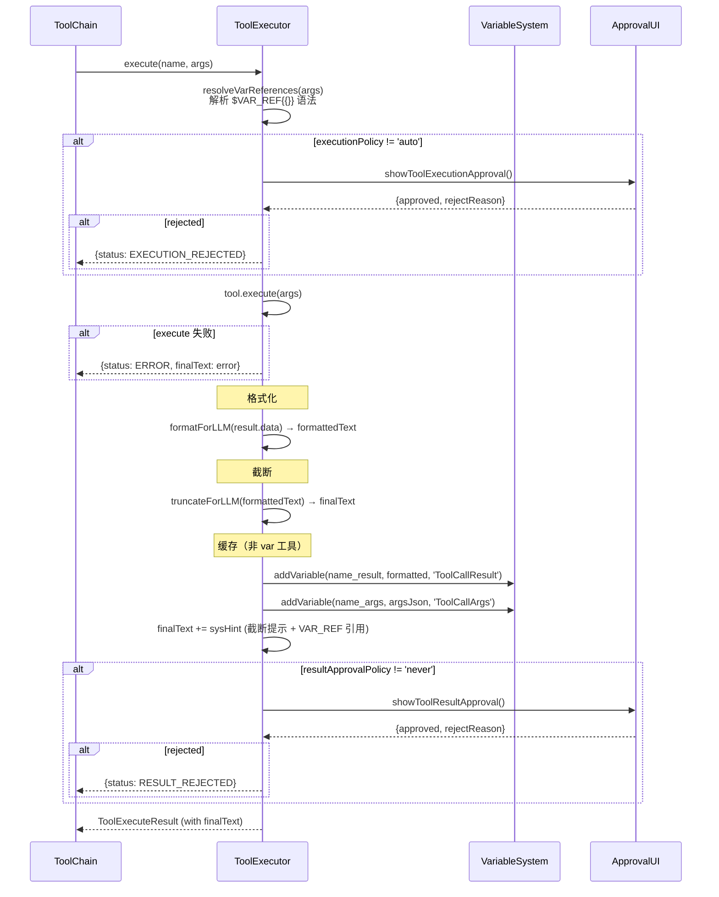

# ToolExecutor 与类型系统

## 类型系统

### Tool 接口（`types.ts`）

```typescript
interface Tool {
    definition:  IToolDefinition;          // OpenAI function spec
    permission:  ToolPermissionV2;         // 执行/结果审批策略
    execute:     (args) => Promise<ToolExecuteResult>;

    // 可选：自定义格式化/截断
    formatForLLM?:  (data, args) => string;
    truncateForLLM?: (formatted, args) => string;

    // 可选：控制标志
    SKIP_EXTERNAL_TRUNCATE?: boolean;      // true → 跳过截断
    SKIP_CACHE_RESULT?: boolean;           // true → 不缓存到 VarSystem（未启用）
    DEFAULT_OUTPUT_LIMIT_CHAR?: number;    // 默认截断长度（覆盖全局默认值）

    // 可选：用于工具链日志显示的压缩函数
    compressArgs?:   (args) => string;
    compressResult?: (result) => string;

    // 可选：供 LLM 了解返回类型
    declaredReturnType?: { type: string; note?: string };
}
```

**关键字段说明**：
- `definition.function.name`：工具唯一标识，在 registry 中作为 key
- `formatForLLM`：将 `result.data` 转为 LLM 可读文本；未定义时用 `JSON.stringify`
- `truncateForLLM`：对 formatForLLM 的结果进行截断；未定义时用 `truncateContent()`（头尾保留，中间省略）
- `DEFAULT_OUTPUT_LIMIT_CHAR`：默认 `/src/func/gpt/tools/utils.ts` 中 `DEFAULT_LIMIT_CHAR`

### ToolGroup 接口（`types.ts`）

```typescript
interface ToolGroup {
    name: string;
    tools: Tool[];
    rulePrompt?: string | ((enabledToolNames: string[]) => string);
    declareSkillRules?: Record<string, {
        desc: string;       // 出现在 systemPrompt 中的简短描述
        prompt: string;     // 完整规则内容，保存到变量系统
        when?: string;      // 何时使用
        alwaysLoad?: boolean; // true → 内嵌到 systemPrompt；false → 按需 ReadVar
    }>;
}
```

`rulePrompt` 支持函数形式，接收**当前已启用**的工具名列表，用于动态生成规则提示。

### ToolExecuteResult（`types.ts`）

```typescript
interface ToolExecuteResult {
    status: ToolExecuteStatus;  // SUCCESS | ERROR | EXECUTION_REJECTED | RESULT_REJECTED | NOT_FOUND
    data?: any;                 // execute() 返回的原始数据
    error?: string;
    rejectReason?: string;

    // 由 ToolExecutor.execute() 填充
    formattedText?: string;     // data → formatForLLM()
    finalText?: string;         // formattedText → truncateForLLM() + 系统提示
    isTruncated?: boolean;
    cacheVarResult?: string;    // 结果缓存到变量系统的变量名
    cacheVarArgs?: string;      // 参数缓存到变量系统的变量名
    cacheFile?: string;         // 本地文件缓存（当前未启用）
}
```

`data → formattedText → finalText`：三阶段数据流，**最终发送给 LLM 的是 `finalText`**。

---

## ToolExecutor 类

**位置**：`/src/func/gpt/tools/executor.ts`

### 内部状态

| 字段 | 类型 | 说明 |
|------|------|------|
| `registry` | `Record<string, Tool>` | name → Tool 映射 |
| `groupRegistry` | `Record<string, ToolGroup>` | groupName → ToolGroup 映射 |
| `enablingStore` | `IStoreRef<{group, tool}>` | SolidJS 响应式 group/tool 启用状态 |
| `varSystem` | `VariableSystem` | 变量系统（见 [vars.md](./vars.md)） |
| `vfs` | `VFSManager` | 虚拟文件系统（历史遗留，当前为空实现） |
| `varToolNames` | `Set<string>` | vars 工具名集合（execute 中用于跳过缓存） |
| `approvalRecords` | `Record<string, Decision>` | ask-once 策略的历史记录 |
| `executionApprovalCallback` | `UserApprovalCallback` | 执行前审批回调 |
| `resultApprovalCallback` | `ResultApprovalCallback` | 结果审批回调 |

### 注册流程

```
registerToolGroup(group)
  ├── group.tools.forEach → registerTool(tool)
  │     └── registry[name] = tool
  │         enablingStore.update('tool', name, true)   // 工具默认启用
  ├── groupRegistry[group.name] = group
  ├── enablingStore.update('group', name, false)       // 工具组默认禁用
  └── group.declareSkillRules → registerSkillRules()
        └── varSystem.addVariable(Rule/{group}/{name}, rule.prompt, 'RULE')
```

**注意**：工具组注册后默认**禁用**。需通过 `toggleGroupEnabled(name, true)` 或 `toolExecutorFactory` 中的 `groupDefaults` 启用。

### enabled 状态 API

```typescript
isGroupEnabled(name: string): boolean
toggleGroupEnabled(name: string, enabled?: boolean): void
isToolEnabled(name: string): boolean
setToolEnabled(name: string, enabled: boolean): void
getEnabledToolDefinitions(): IToolDefinition[]  // 供 LLM API 使用，自动注入 ReadVar/ListVars
```

`getEnabledToolDefinitions()`：当有任何工具组启用时，自动将 `ReadVar` / `ListVars` 注入返回列表（即使 vars 组未显式启用）。

### toolRules() 生成 System Prompt

```
toolRules()
  ├── 基础规范（禁止伪造日志、VAR 机制说明）
  └── 对每个 enabled group:
        resolveGroupRulePrompt(groupName)
          ├── 调用 rulePrompt（字符串或函数）
          └── 拼接 generateSkillRuleIndex()（alwaysLoad 直接内嵌 / 其余生成表格）
```

---

## execute() 执行流



### 截断逻辑细节

1. `SKIP_EXTERNAL_TRUNCATE = true` → 跳过所有截断
2. `tool.truncateForLLM` 存在 → 使用工具自定义截断（可读取 `args.limit` / `args.begin`）
3. 否则使用 `truncateContent(formatted, limit)`（默认头尾各保留部分，中间省略）
4. `args.limit = 0 或 -1` → 不截断（发送完整内容）

### 变量缓存逻辑

- **vars 工具组自身**（`varToolNames`）不触发缓存，避免递归
- 其他所有工具：结果缓存为 `{toolName}_{nodeId}_result`，参数缓存为 `{toolName}_{nodeId}_args`
- 无论是否截断都进行缓存；truncated 时在 `finalText` 末尾附加截断提示 + `$VAR_REF{{...}}` 引用

---

## toolExecutorFactory（`index.ts`）

工厂函数，每个 ChatSession 调用一次：

```typescript
toolExecutorFactory({ approvalAdapter? })
  1. new ToolExecutor({})                         // 创建实例（内部已注册 vars 工具组）
  2. registerToolGroup(basicTool)
  3. registerToolGroup(toolGroupWeb)
  4. registerToolGroup(createFileSystemToolGroup())
  5. IS_IN_APP && registerToolGroup(scriptTools)   // 仅桌面端
  6. registerToolGroup(siyuanTool)
  7. IS_IN_APP:
       createCustomScriptToolGroupsFromCache()
       → 对每组调用 registerToolGroup()
       → 如果 groupDefaults 有记录，应用启用状态
  8. 绑定 executionApprovalCallback               // 代理到 approvalAdapter
  9. 绑定 resultApprovalCallback                  // 代理到 approvalAdapter
  10. 应用 toolsManager().groupDefaults → toggleGroupEnabled
  11. 应用 toolsManager().toolDefaults → setToolEnabled
  return toolExecutor
```

**集成点**（`use-chat-session.ts`）：

```typescript
const pendingApprovals = useStoreRef<PendingApproval[]>([]);
const inlineApprovalAdapter = new InlineApprovalAdapter(pendingApprovals, newID);
const toolExecutor = toolExecutorFactory({ approvalAdapter: inlineApprovalAdapter });
```

每个 ChatSession 独立拥有一个 `ToolExecutor` 实例（含独立 `VariableSystem`）。
