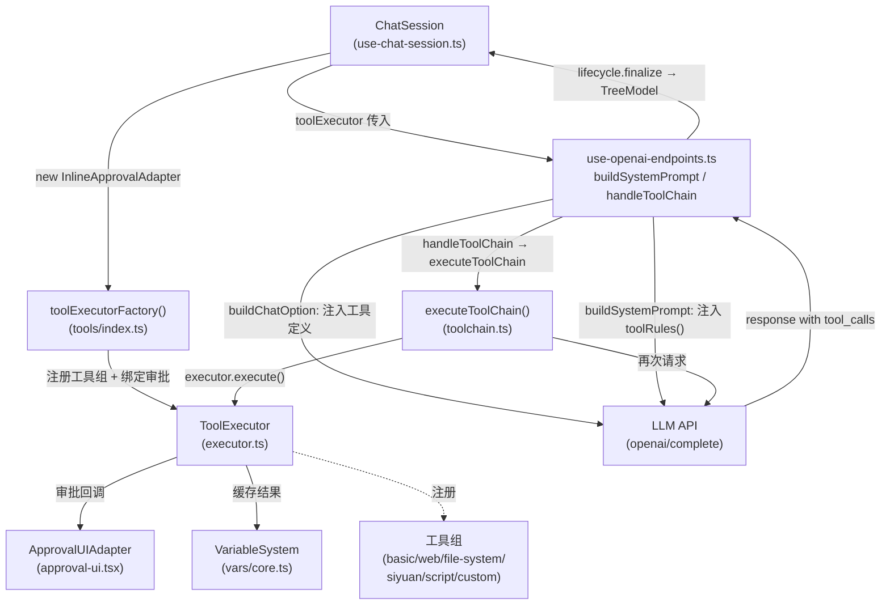

# Tool Call 机制

## 导航

| 文档 | 内容 |
|------|------|
| [executor.md](./executor.md) | 类型系统、ToolExecutor 注册与执行核心 |
| [toolchain.md](./toolchain.md) | LLM↔工具对话循环、MessageFlowFormatter、压缩设计 |
| [approval.md](./approval.md) | 权限模型、审批 UI 适配器 |
| [vars.md](./vars.md) | 变量系统、\$VAR_REF 语法、Skill Rules |
| [custom-tools.md](./custom-tools.md) | 自定义脚本工具（Python/PowerShell）解析与加载 |
| [integration.md](./integration.md) | Chat 集成层：注入、systemPrompt、执行链路、结果持久化 |

---

## 整体架构



---

## 工具调用全链路（简版序列）

```
用户发送消息
  ↓
ChatSession.sendMessage()  [use-chat-session.ts]
  ↓
useGptCommunication.sendMessage()  [use-openai-endpoints.ts]
  ├── getAttachedHistory()          ← 在创建占位前获取（避免占位污染历史）
  ├── lifecycle.prepareSlot()       ← TreeModel 插入 loading 占位
  └── executeChatRequest()
        ├── buildSystemPrompt()     ← 用户 prompt + toolRules()（工具规则）
        ├── buildChatOption()       ← 注入 tools + tool_choice='auto'
        ├── gpt.complete(messages)  ← 第一次 LLM 请求
        └── if response.tool_calls → handleToolChain()
              └── executeToolChain(executor, response, options)  [toolchain.ts]
                    [循环] for each tool_call:
                      executor.execute(name, args)   [executor.ts]
                      → 解析 $VAR_REF
                      → checkExecutionApproval() → 可能弹审批 UI
                      → tool.execute(args)
                      → format → truncate → 缓存到 VariableSystem
                      → checkResultApproval() → 可能弹审批 UI
                      → 构建 {role:'tool'} 消息
                    重新调用 LLM... 直到无 tool_calls 或达 maxRounds
                    MessageFlowFormatter:
                      toolChainContent = <SYSTEM-CONTEXT>...</SYSTEM-CONTEXT>---
                      responseContent  = 工具日志块 + 最终回复
  ↓
lifecycle.finalize()  ← 写入 content = toolChainContent + responseContent
                         hintSize = toolChainContent.length
                         toolChainResult = 完整调用历史
  ↓
TreeModel 更新 → UI 响应式刷新
```

---

## 工具组汇总

| 工具组名 | 主要工具 | 特殊机制 |
|---------|---------|---------|
| `basic` | 时间、计算 | — |
| `web` | Bing/Google/Tavily 搜索、FetchWebPage、ExtractContent | extractHtml 返回 DOM 结构 |
| `file-system` | ViewFile、EditFile、ShellCommand、ListDirectory | ShellCommand 仅桌面端 |
| `siyuan` | SearchBlocks、GetDocument、UpdateBlock、DiffEdit | DiffEdit 涉及复杂差异算法（见代码） |
| `vars` | ReadVar、WriteVar、ListVars、RemoveVars | 内置，当有其他工具启用时自动注入 |
| `script` | ExecuteJS、ExecuteShell | 仅桌面端 (`IS_IN_APP`) |
| 自定义工具组 | 由 `.tool.json` 描述，Python/PowerShell 执行 | 见 [custom-tools.md](./custom-tools.md) |

> **不在本文档覆盖范围**：
> - 各工具组内部实现细节（如 Bing API 调用、DiffEdit 差异算法）
> - `toolcall-script/` 目录（已废弃）
