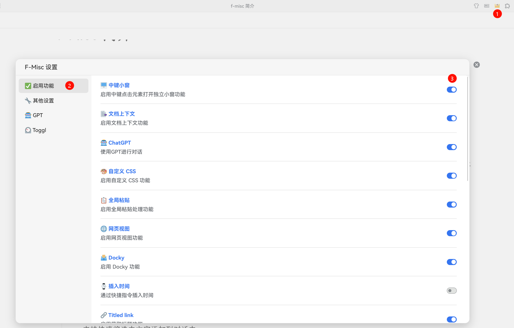

## Preliminary

1. **介绍说明：**   本插件集成了多种个人常用的功能，少部分功能迁移自其他插件。
2. **免责声明：**   本插件为个人自用，不保证任何意义上的稳定性。  
    **无国际化：**   本插件仅为个人使用，暂不考虑多语言支持；**可能存在硬编码：**   插件内部可能存在一些硬编码的变量，例如个人笔记本 ID 等；**跨平台适配弱：**   本插件主要为思源本地 Electron 应用设计，未针对其他系统、服务器模式或移动端进行特别适配，可能存在兼容性问题

请用户在使用前仔细阅读以上说明，并根据自身需求进行评估决定是否使用。若开发者对本插件中的特定子功能感兴趣，请在尊重 **GPL-v3 开源协议**的前提下进行开发。

---

🔔 注：默认情况下并非所有功能都自动启用，请打开插件设置，在「启用」栏目中根据自己的需求启用响应的功能。

​​

## 目前的功能概览

* GPT 对话

  * 社区有个帖子对对话功能的介绍还算全面，**可以参考**：[思源 GPT 对话插件推荐：f-misc 插件](https://ld246.com/article/1737626817055)
  * 在思源内创建独立的对话界面

    * 右上角按钮创建对话
    * 或者Ctrl + Shift + L 快捷键打开对话
  * 优秀的多轮对话界面
  * LLM 模型 (Chat API)、Prompt 管理
  * 对话记录保存、管理、多端同步
  * 和思源笔记结合

    * 笔记 Context Provder; 将笔记相关内容加入对话中
    * 将对话内容保存到思源笔记中
* 自定义 CSS 文件

  * 在 public 目录下创建一个 custom.css
  * 用户可以在本地用编辑器编辑 custom.css
  * 本质和代码片段区别不大，不过如果用代码编辑器编写体验自然会更好
* Super Ref

  * 一个将双向链接和数据库自动绑定，从而模拟 Tana 的 SuperTag 的方案
  * 详情参见：[将反向链接和数据库结合的尝试 - 链滴](https://ld246.com/article/1739206311467 "将反向链接和数据库结合的尝试 - 链滴")
* Toggl

  * 一个简易的 Toggl 客户端
  * 定期将 Toggl 的 Time Entries 插入到 Daily Note 中
  * 需要绑定 Toggl 账号的 API Token 使用
* Zotero 工具

  * 注意需要使用 zotero debug bridge 绑定 zotero

    * 详情参考「文献引用」插件中对 Debug Bridge 的介绍，本插件采用和这个插件一样的连接方式
    * 需要在设置中配置连接的密码
  * 引用选中的 Zotero 论文条目
  * 将选定论文的笔记导入到思源中

    * 注意，zotero 笔记中的图片默认只会以 `file:///`​ 链接的形式插入到笔记中；你可以在思源文档中自行将「网络资源图片转换到本地」，来将这些图片导入到思源当中
* 侧边栏显示块

  * 迁移自侧边显示插件，调整了使用方式
  * 允许在侧边栏显示 Protyle 编辑器
* 迁移引用

  * 将反向链接块迁移到同一笔记本中
* 新建空白附件: 在思源中快速创建空白的 Markdown（.md）、文本文件（.txt）、Word 文档（.docx）等

  * 使用 `/ni`​ 创建文档
  * word, ppt, excel 空白文件需要自行在 `data\public\blank-files`​ 下面放空白模板文件
* Quick Draft: 模仿快速卡片写作插件，快速创建独立的编辑窗口（主要当草稿用）

  * 全局注册 Alt + Shift + G 快捷键
  * 默认以卡片样式显示，Alt + Y 可以返回到普通的编辑器样式
* Webview 网页视图: 在新窗口中打开 Webview，模仿自其他插件
* 全局 Paste 处理：自定义粘贴事件，例如在粘贴 URL 文本时自动转换为链接等
* WebSocket：允许外部通过 broadcast API 发送命令让插件执行；主要和 quicker 配合使用

* 中间小窗 (已拆分上架)
* 文档上下文 (已拆分上架)
* Insert Time  (已拆分上架)
* 更换主题 (已拆分上架)
* Titled Link（已拆分上架）
* ~~Bookmark+（拆分上架并从本插件中删除）~~
* ~~QueryView（拆分上架并从本插件中删除）~~

其他还有一些不那么重要的功能，不再一一赘述。

‍
