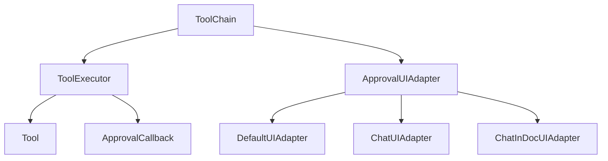
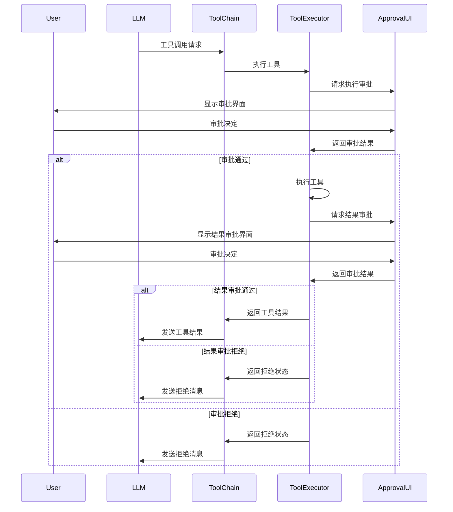

# 工具系统设计文档

## 1. 系统概述

### 1.1 设计目标

工具系统旨在提供一个灵活、安全且可扩展的框架，使LLM能够通过调用工具与外部系统交互。主要设计目标包括：

- **安全性**：提供多层次的权限控制，确保敏感操作得到适当的用户审批
- **灵活性**：支持不同场景下的工具调用和审批UI
- **可扩展性**：易于添加新工具和自定义审批流程
- **可维护性**：清晰的组件边界和职责划分

### 1.2 核心功能

- 工具注册和管理
- 基于权限级别的执行审批
- 工具结果审批
- 工具调用链执行
- 多场景审批UI适配

## 2. 架构设计

### 2.1 核心组件

工具系统由以下核心组件组成：

- **Tool**：工具定义和执行函数
- **ToolExecutor**：工具执行器，负责工具注册、管理和执行
- **ApprovalUIAdapter**：审批UI适配器，负责显示审批界面
- **ToolChain**：工具调用链，负责协调整个工具调用流程

### 2.2 组件关系图



### 2.3 数据流图



## 3. 关键概念

### 3.1 工具定义

工具定义包含工具的元数据、权限级别和执行函数。每个工具都有一个唯一的名称、描述和参数定义。

**相关文件**：[src/func/gpt/tools/types.ts](src/func/gpt/tools/types.ts)

### 3.2 权限模型

工具系统采用多层次的权限模型，包括：

- **权限级别**：
  - `PUBLIC`：公开工具，无需用户审批
  - `MODERATE`：中等敏感度工具，首次需要审批，之后可记住用户选择
  - `SENSITIVE`：敏感工具，每次都需要审批

- **细粒度控制**：
  - `requireExecutionApproval`：控制是否需要执行审批
  - `requireResultApproval`：控制是否需要结果审批

**相关文件**：[src/func/gpt/tools/types.ts](src/func/gpt/tools/types.ts)

### 3.3 审批机制

工具系统使用回调函数处理审批请求，将UI交互与核心逻辑分离。审批机制包括：

- **执行审批**：在工具执行前进行审批
- **结果审批**：在工具执行后，结果发送给LLM前进行审批
- **审批记录**：对于MODERATE级别的工具，可以记住用户的审批决定

**相关文件**：[src/func/gpt/tools/executor.ts](src/func/gpt/tools/executor.ts)

### 3.4 工具调用链

工具调用链负责协调整个工具调用流程，包括：

- 解析LLM响应中的工具调用
- 执行工具并处理结果
- 将结果发送回LLM
- 管理消息历史和工具调用历史

**相关文件**：[src/func/gpt/openai/toolchain.ts](src/func/gpt/openai/toolchain.ts)

## 4. 设计决策与权衡

### 4.1 回调函数 vs 直接UI交互

**决策**：使用回调函数处理审批请求，而不是在ToolExecutor中直接处理UI交互。

**原因**：
- **关注点分离**：ToolExecutor专注于工具执行逻辑，不关心UI实现
- **灵活性**：可以根据不同场景使用不同的UI实现
- **可测试性**：便于单元测试，可以模拟回调函数

### 4.2 权限级别设计

**决策**：采用三级权限模型（PUBLIC、MODERATE、SENSITIVE）。

**原因**：
- **简单性**：三级权限足以覆盖大多数使用场景
- **用户体验**：MODERATE级别允许记住用户选择，减少重复审批
- **安全性**：SENSITIVE级别确保敏感操作每次都得到审批

### 4.3 工具调用链设计

**决策**：将工具调用链作为独立组件，而不是集成到LLM调用中。

**原因**：
- **模块化**：便于独立维护和测试
- **灵活性**：可以在不同场景中重用
- **扩展性**：便于添加新功能，如并行工具调用

## 5. 扩展点

### 5.1 自定义工具

系统支持通过以下方式添加自定义工具：

- 实现Tool接口
- 注册到ToolExecutor
- 设置适当的权限级别和控制选项

### 5.2 自定义审批UI

系统支持通过实现ApprovalUIAdapter接口来自定义审批UI：

- 实现showToolExecutionApproval方法
- 实现showToolResultApproval方法
- 在工具调用链中使用自定义适配器

### 5.3 工具调用链定制

系统支持通过ToolChainOptions定制工具调用链行为：

- 设置最大轮次和调用次数
- 提供自定义回调函数
- 控制是否检查工具结果

## 6. 文件结构

```
src/func/gpt/
├── openai/
│   ├── toolchain.ts     # 工具调用链执行逻辑
│   └── complete.ts      # LLM 调用接口
├── tools/
│   ├── executor.ts      # 工具执行器
│   ├── approval-ui.tsx  # 审批 UI 组件和适配器
│   ├── types.ts         # 类型定义
│   └── index.ts         # 导出工具相关函数和接口
```

### 6.1 关键接口

```typescript
// 工具权限级别
enum ToolPermissionLevel {
    PUBLIC = 'public',
    MODERATE = 'moderate',
    SENSITIVE = 'sensitive'
}

// 工具执行状态
enum ToolExecuteStatus {
    SUCCESS = 'success',
    ERROR = 'error',
    EXECUTION_REJECTED = 'execution_rejected',
    RESULT_REJECTED = 'result_rejected',
    NOT_FOUND = 'not_found'
}

// 工具定义
interface Tool {
    definition: ToolDefinitionWithPermission;
    execute: ToolExecuteFunction;
    tags?: string[];
}

// 审批UI适配器
interface ApprovalUIAdapter {
    showToolExecutionApproval(...): Promise<...>;
    showToolResultApproval(...): Promise<...>;
}
```

## 7. 使用场景

### 7.1 典型使用场景

1. **安全但结果敏感的工具**：
   - 搜索个人数据的工具，执行本身安全，但结果可能包含敏感信息
   - 配置：PUBLIC权限级别，启用结果审批

2. **需要审批但结果安全的工具**：
   - 发送邮件的工具，需要审批执行，但结果（发送状态）不敏感
   - 配置：MODERATE或SENSITIVE权限级别，不启用结果审批

3. **完全安全的工具**：
   - 获取当前时间的工具
   - 配置：PUBLIC权限级别，不启用结果审批

4. **高度敏感的工具**：
   - 修改系统设置的工具，需要严格控制执行和结果
   - 配置：SENSITIVE权限级别，启用结果审批

### 7.2 最佳实践

1. **工具定义**：
   - 为每个工具选择合适的权限级别和控制选项
   - 提供详细的工具描述和参数说明
   - 使用标签对工具进行分类和管理

2. **权限控制**：
   - 对于可能返回敏感信息的工具，启用结果审批
   - 对于完全安全的工具，使用PUBLIC权限级别
   - 对于需要严格控制的工具，使用SENSITIVE权限级别

3. **UI适配**：
   - 根据使用场景选择合适的UI适配器
   - 为不同场景提供一致的用户体验

4. **工具调用链**：
   - 设置合理的轮次和调用次数限制
   - 使用回调函数提供实时反馈
   - 处理错误和异常情况
